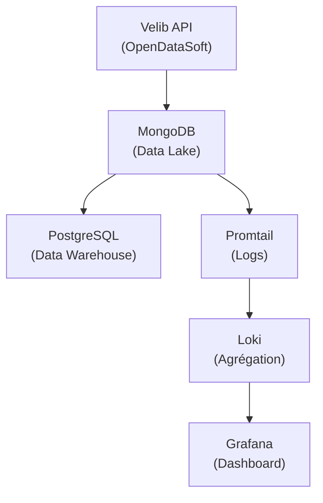

# Velib ETL Pipeline

Pipeline ETL (Extract, Transform, Load) pour les données temps réel du système de vélos en libre-service Velib' de Paris.

## Architecture



## Stack Technique

| Composant | Technologie | Version |
|-----------|-------------|---------|
| Orchestration | Apache Airflow | 2.10.0 |
| Data Lake | MongoDB | 8.2 |
| Data Warehouse | PostgreSQL | 18.1 |
| Message Broker | Redis | 7.2 |
| Visualisation | Grafana | 10.2.3 |
| Logs | Loki + Promtail | 2.9.3 |
| Langage | Python | 3.10+ |
| Conteneurisation | Docker Compose | - |

## Structure du Projet

```
bidata/
├── airflow/
│   ├── dags/
│   │   └── velib_etl_dag.py      # DAG principal
│   ├── logs/                      # Logs d'exécution
│   └── plugins/                   # Plugins Airflow
├── src/
│   ├── getApi.py                  # Extraction (API → MongoDB)
│   └── traitement.py              # Transformation (MongoDB → PostgreSQL)
├── tests/
│   ├── conftest.py                # Fixtures pytest
│   ├── test_getApi.py             # Tests extraction
│   ├── test_traitement.py         # Tests transformation
│   └── test_dag_integrity.py      # Tests DAG
├── monitoring/
│   ├── grafana/
│   │   └── provisioning/          # Dashboards et datasources
│   └── promtail/
│       └── promtail-config.yml    # Configuration logs
├── .github/workflows/
│   ├── ci.yml                     # Pipeline CI
│   └── cd.yml                     # Pipeline CD
├── docker-compose.yaml            # Infrastructure
├── Makefile                       # Commandes utilitaires
├── requirements.txt               # Dépendances production
└── requirements-dev.txt           # Dépendances développement
```

## Installation

### Prérequis

- Docker et Docker Compose
- Python 3.10+
- Make (optionnel)

### Démarrage Rapide

1. **Cloner le repository**
   ```bash
   git clone https://github.com/kipavy/bigdata-filrouge
   cd bigdata-filrouge
   ```

2. **Configurer l'environnement**
   ```bash
   cp .env.example .env
   # Éditer .env avec vos paramètres
   ```

3. **Lancer les services**
   ```bash
   make docker-up
   # ou
   docker compose up -d
   ```

4. **Accéder aux interfaces**
   - Airflow: http://localhost:8080 (admin/admin)
   - Grafana: http://localhost:3000 (admin/admin)

## Configuration

### Variables d'Environnement

| Variable | Description | Défaut |
|----------|-------------|--------|
| `POSTGRES_USER` | Utilisateur PostgreSQL | airflow |
| `POSTGRES_PASSWORD` | Mot de passe PostgreSQL | - |
| `POSTGRES_DB` | Base de données | airflow |
| `MONGO_INITDB_ROOT_USERNAME` | Utilisateur MongoDB | mongo |
| `MONGO_INITDB_ROOT_PASSWORD` | Mot de passe MongoDB | - |
| `MONGO_DB` | Base MongoDB | velib_datalake |
| `VELIB_API_BASE_URL` | URL API Velib | OpenDataSoft |
| `AIRFLOW__CORE__FERNET_KEY` | Clé de chiffrement Airflow | - |

## Pipeline ETL

### Extraction (`src/getApi.py`)

Récupère les données temps réel de l'API Velib (OpenDataSoft) et les stocke dans MongoDB.

**Données collectées:**
- Code et nom des stations
- Coordonnées GPS
- Capacité totale
- Vélos disponibles (mécaniques et électriques)
- Bornes disponibles
- État opérationnel

### Transformation (`src/traitement.py`)

Transforme les données brutes en schéma analytique PostgreSQL.

**Tables créées:**

```sql
-- Données maître des stations
stations (
    station_id,
    name,
    latitude, longitude,
    capacity,
    arrondissement,
    insee_code,
    created_at, updated_at
)

-- Série temporelle de disponibilité
station_availability (
    station_id,
    mechanical_bikes,
    electric_bikes,
    docks_available,
    is_operational,
    last_reported,
    ingested_at
)
```

### Orchestration (Airflow)

- **DAG:** `velib_etl`
- **Fréquence:** Toutes les 5 minutes
- **Tâches:** `extract_velib_data` → `transform_and_load`
- **Retries:** 2 tentatives avec délai de 1 minute

## Développement

### Installation des Dépendances

```bash
# Production
make install

# Développement (inclut pre-commit)
make install-dev
```

### Commandes Make

```bash
# Linting et formatage
make lint          # Vérifier le code
make format        # Formater le code

# Tests
make test          # Lancer les tests
make test-cov      # Tests avec couverture

# Docker
make docker-up     # Démarrer les services
make docker-down   # Arrêter les services
make docker-logs   # Voir les logs

# Base de données
make db-shell-postgres   # Shell PostgreSQL
make db-shell-mongo      # Shell MongoDB

# Airflow
make airflow-shell       # Shell dans Airflow
make dag-list            # Lister les DAGs
make dag-test            # Tester le DAG
```

### Pre-commit Hooks

Le projet utilise pre-commit pour garantir la qualité du code:

- Formatage (Black, Ruff)
- Linting (Ruff, mypy)
- Validation YAML/JSON
- Détection de secrets
- Tests automatiques

```bash
# Installation
pre-commit install

# Exécution manuelle
pre-commit run --all-files
```

## Tests

```bash
# Tous les tests
pytest

# Avec couverture
pytest --cov=src --cov=airflow/dags --cov-report=html

# Tests spécifiques
pytest tests/test_getApi.py -v
pytest tests/test_traitement.py -v
pytest tests/test_dag_integrity.py -v
```

## Monitoring

### Grafana

Dashboard préconfigurés pour visualiser:
- Disponibilité des vélos par station
- Tendances d'utilisation
- Logs des pipelines

### Loki + Promtail

Agrégation centralisée des logs Airflow avec:
- Parsing multiline
- Extraction de métadonnées (timestamp, task, level)
- Filtrage par label

## CI/CD

### Intégration Continue (CI)

Déclenchée sur push/PR vers `main` ou `develop`:

1. **Lint & Format** - Ruff, Black, mypy
2. **Tests Unitaires** - pytest avec couverture
3. **Validation DAG** - Import et structure
4. **Build Docker** - Validation docker-compose
5. **Scan Sécurité** - Bandit, Safety

### Déploiement Continu (CD)

Déclenchée sur push vers `main` ou tag `v*`:

1. **Build & Push** - Images Docker vers ghcr.io
2. **Staging** - Déploiement automatique + health checks
3. **Production** - Approbation manuelle, backup DB, rollback automatique

## API Velib

**Source:** [OpenDataSoft - Velib Métropole](https://data.opendatasoft.com/)

**Endpoint:**
```
https://data.opendatasoft.com/api/records/1.0/search/?dataset=velib-disponibilite-en-temps-reel
```

**Champs utilisés:**
- `stationcode` - Identifiant unique
- `name` - Nom de la station
- `coordonnees_geo` - Latitude, Longitude
- `capacity` - Capacité totale
- `numbikesavailable` - Vélos disponibles
- `mechanical` - Vélos mécaniques
- `ebike` - Vélos électriques
- `numdocksavailable` - Bornes disponibles
- `is_installed` / `is_renting` / `is_returning` - État opérationnel

## Contribuer

1. Fork le projet
2. Créer une branche (`git checkout -b feature/ma-fonctionnalite`)
3. Commit les changements (`git commit -m 'Ajout de ma fonctionnalité'`)
4. Push la branche (`git push origin feature/ma-fonctionnalite`)
5. Ouvrir une Pull Request

## License

Ce projet est développé dans le cadre d'un cours à l'École des Mines.

## Auteur

Clément TRENS, Killian PAVY, Rémy LOURON - École des Mines - S10 Data
